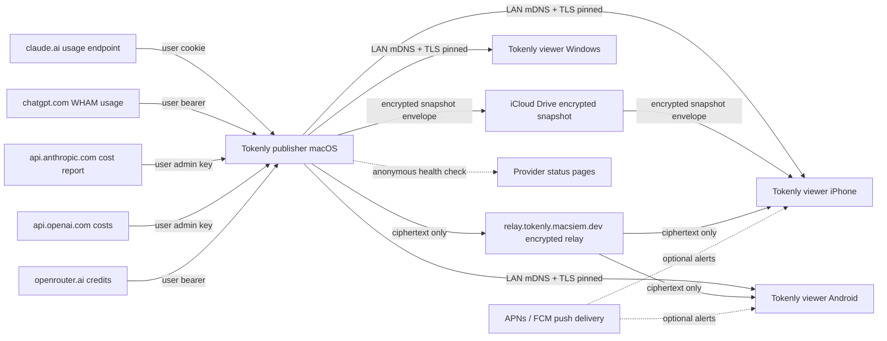

# Architecture overview

Tokenly is split into one **publisher** (macOS) and three **viewers** (iOS, Android, Windows). The publisher does the work; the viewers mirror the result.

## Mermaid

## Publisher — macOS

- Hosts every provider credential.
- Runs the connectors (Rust core) on a 30-minute timer (user-configurable).
- Aggregates results into a single snapshot JSON.
- Publishes that snapshot two ways:
  - **LAN** — a small HTTPS endpoint discovered via mDNS (`_usagedeck._tcp`). TOFU fingerprint pinned.
  - **iCloud** — an AES-GCM-encrypted envelope written to the `iCloud.dev.macsiem.tokenly` container so paired iPhones can pull it when off the home Wi-Fi.

## Viewers — iOS / Android / Windows

- Hold pairing material only: a per-Mac session token, the Mac's TLS fingerprint, and the HMAC secret.
- Never hold provider credentials. Never see provider responses in cleartext beyond the snapshot the Mac chose to publish.
- Render the gauges, widgets, and notifications locally.
- May receive end-to-end-encrypted snapshots through the optional relay at `relay.tokenly.macsiem.dev` and alerts through the platform push service; neither path receives provider credentials or prompt content.

## Why this split

The publisher / viewer split is the privacy contract: provider credentials touch exactly one device (the Mac that's already logged into Anthropic / OpenAI / Google / etc. in your browser), and the screens on your other devices are downstream of that.

Other architectures we considered and rejected:

- **Credential or plaintext-data proxy.** Would require us to operate a server that sees usage data or provider credentials. Disqualified on first principle. The optional snapshot relay carries ciphertext only and cannot decrypt it.
- **Per-device credentials.** Would put session cookies on every device, multiplying credential exposure surface. Disqualified.
- **Pure on-device per-app.** Would mean the iPhone fetches Anthropic itself. Disqualified because the iPhone doesn't have your active Claude session cookies (you log in via Safari on the Mac) and we'd have to ship credential capture for every platform.

## How updates work

- The publisher and viewers ship through their respective app stores. Each store-signed update is auto-applied.
- Pairing material survives updates on all four platforms (Keychain / EncryptedSharedPreferences / Credential Manager are OS-managed, not app-managed).
- No silent over-the-air config / model / connector updates. If Anthropic changes their endpoint, a new app version ships with the fix.

## Legacy (removed in 0.7.2 b86)

Desktop builds through 0.7.2 b85 could contact the Cloudflare Worker at `trial.tokenly.macsiem.dev` for the former trial and licence checks. It received an opaque device/account identifier and, for licence validation, a licence key. Current builds make no calls to it, and the endpoint is scheduled for decommission after the legacy-build transition.
